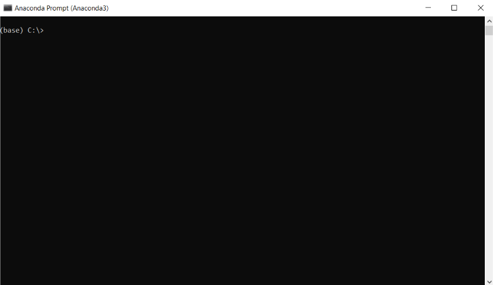
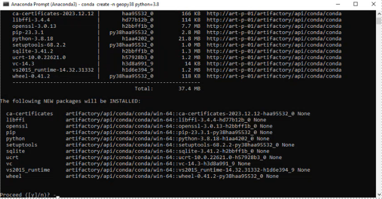
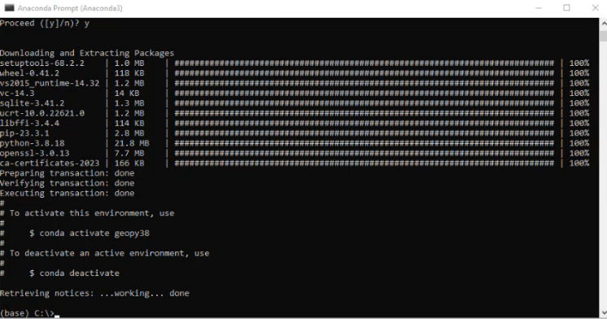
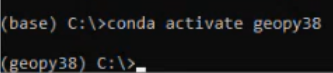
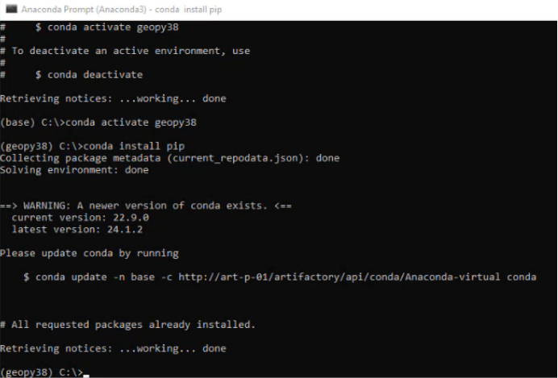
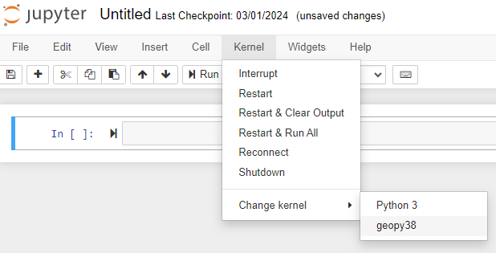

# Installation guide for Python Geospatial packages 

## Before you start: 

 
You will need to install **Anaconda** (a Python distribution used for data science, [more information here](https://www.anaconda.com/download).   
 
Once it is installed, open **Anaconda Prompt** (this can be done from the start menu).  

The prompt should say “*(base) C:\>*”. Base is the standard conda environment which behaves similarly to Python. The goal of this guide is to create a GeoPy environment which will support geospatial work in Python.

C:\ is the working directory, which in this case is the root directory of the system drive. If this is not “C:\”, type ‘*c:*’ to set the system drive to the working directory.  
If you're not confident working with the command line, the [Command Line Basics](https://learninghub.ons.gov.uk/course/view.php?id=494) course on the ONS Learning Hub is a really good resource. 
 

## Installing the packages: 

 
Once you’re happy to continue, in the prompt type: 

*conda create -n geopy38 python=3.8*

This will create a new virtual environment for python called GeoPy38, which is where we will install the geospatial packages. 

This can potentially take a while (up to a few minutes). Getting a coffee might be a good use of this time and will help with future steps! :coffee:

Press *y* and *enter* when prompted. Please note that this process can fail with a 500 error. If this happens wait a little while and try again. 

To activate the environment, type:  

*conda activate geopy38* 

If the steps until now have worked it will now say “(geopy38)” before the prompt, indicating that you are in the GeoPy environment. Next, type: 

*conda install pip* 

This could also take a little while as it’s a large install. This would be a good time to make use of that coffee from earlier. :coffee: 

 

Now we can install the packages. Type each of these in sequence, followed by enter. (wait for each package to complete installation before moving on to the next one). You can also copy and paste from this list, one at a time: 

*pip install numpy==1.22.4*

(It is possible that NumPy might not install correctly. If so, in Windows Explorer go to user\Anaconda3\envs\geopy38\Lib\site-packages and delete a file there called ~unpy. Try again and NumPy should install) 

*pip install pandas==2.0.3*

*pip install ipython==8.12.3* 

*pip install ipykernel* 

*pip install rtree==0.9.7* 

*pip install gdal==3.2.2* 

*pip install fiona==1.1.18* 

*pip install pyproj==3.0.1* 

*pip install shapely==1.7.1* 

*pip install geopandas* 

*pip install matplotlib* 

*pip install mapclassify==2.4.2* 

*pip install folium* 

*python -m pip install census21api@git+https://github.com/datasciencecampus/census21api* 

*python -m ipykernel install --user --name geopy38*

 

## Testing the installation & further activities: 

 

Having done this GeoPy should be available for use on your PC. To test that it is working open Jupyter Notebook from your Start menu, then create a new Python notebook. 

 

You can see if it has installed correctly by going into the **Kernel menu -> Change kernel**: if geopy38 is in this list then the environment has been set up correctly and you should be able to start doing Geospatial work in Python. 

A great next step would be [Introduction to GIS in Python](https://github.com/ONSgeo/geospatial-training/blob/r-py-install-guides/_docs/intro_to_gis_in_python.md). 

 
