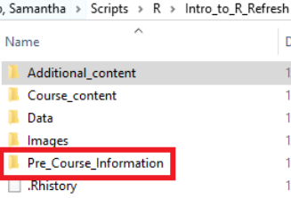

# Installation guide for R Geospatial packages 

## Useful training courses for starting out with GIS in R: 

 
### Introduction to R: 

https://learninghub.ons.gov.uk/course/view.php?id=498 

This course is quite long (about 20 hours) but brings you up to a level needed to do further training in GIS in R.  

The Introduction to R course is downloaded to your computer and the course files are found in the *Course_content* directory. More thorough installation guidance is found in the *Pre_Course_Information* folder which you can refer to if you are having trouble with the instructions in this guide. 

  

### Introduction to GIS in R: 

https://onsgeo.github.io/geospatial-training/docs/intro_to_gis_in_r 

This course builds on what you learn in the Introduction to R and introduces the sf and tmap packages. Note that its instructions for installing libraries are incomplete and will not work, you must install them using the format: *install.packages(“package_name2”, dependencies = TRUE, type = “win.binary”)*

## Suggested R packages to install: 

 
This is a list of packages that are important for GIS and a link to their documentation. 

[Janitor](https://www.rdocumentation.org/packages/janitor/)

[sf](https://r-spatial.github.io/sf/) 

[Tidyverse](https://www.tidyverse.org/) including: 

- [dplyr](https://dplyr.tidyverse.org/) 
- [ggplot](https://ggplot2.tidyverse.org/)
- [readr](https://readr.tidyverse.org/) 
- [stringr](https://stringr.tidyverse.org/) 
- [tibble](https://tibble.tidyverse.org/) 
- [tidyr](https://tidyr.tidyverse.org/) 

