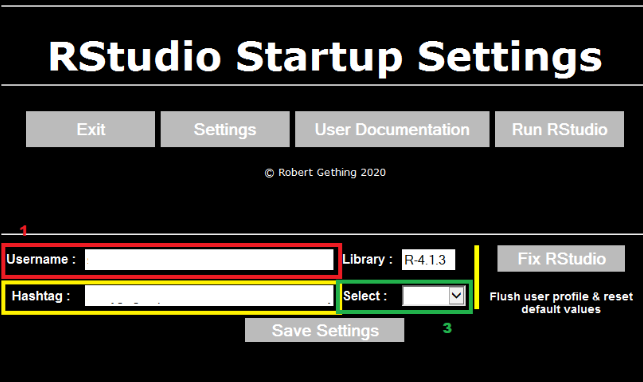

# Installation guide for R Geospatial packages 

 
## Setting up

ONS uses Artifactory to store/manage R packages and it must be linked to RStudio, or it will not be possible to install packages on your computer. 

Log in to [Artifactory](http://art-p-01/artifactory/webapp/#/login) with your ONS username and password. 

Click your username in the top right corner. Enter your password again and press ‘unlock’. Then press the copy icon next to the encrypted password (to the right of the eye).  

 

Start RStudio and in the window that pops up, click “Settings”: 

 

Enter your username in the Username field (1), paste the password you copied from Artifactory into the Hashtag field (2), and select the most recent version/highest number available from the dropdown menu (3).

 

Press Save Settings and then "Run RStudio". 
 

## Installing packages: 

The console pane in RStudio is in the lower left by default. This is where packages are installed. 

Type (or copy and paste) the following code in to install packages: 

*install.packages(“tidyverse”, dependencies = TRUE, type = “win.binary”)*

**tidyverse** is an R module which includes tools for transforming and presenting data. 

*install.packages(“janitor”, dependencies = TRUE, type = “win.binary”)*

**janitor** is useful for cleaning data and works well with tidyverse. 

Note: sometimes package installation will fail because of a missing dependency (a package needed for the one you’re installing to work). If this happens, an error message in the console will tell you what package or packages you’re missing. Install them using the same code as above, changing the package name in quotations. For instance, to install tmap (Thematic Maps, used for creating maps) you would type: 

*install.packages(“tmap”, dependencies = TRUE, type = “win.binary”)*

Once everything you need is installed you can try to install the package again.  
 

## Useful training courses for starting out with GIS in R: 

 
### Introduction to R: 

https://learninghub.ons.gov.uk/course/view.php?id=498 

This course is quite long (about 20 hours) but brings you up to a level needed to do further training in GIS in R.  

The Introduction to R course is downloaded to your computer and the course files are found in the *Course_content* directory. More thorough installation guidance is found in the *Pre_Course_Information* folder which you can refer to if you are having trouble with the instructions in this guide. 

  

### Introduction to GIS in R: 

https://onsgeo.github.io/geospatial-training/docs/intro_to_gis_in_r 

This course builds on what you learn in the Introduction to R and introduces the sf and tmap packages. Note that its instructions for installing libraries are incomplete and will not work, you must install them using the format: *install.packages(“package_name2”, dependencies = TRUE, type = “win.binary”)*

## Suggested R packages to install: 

 
This is a list of packages that are important for GIS and a link to their documentation. 

[Janitor](https://www.rdocumentation.org/packages/janitor/)

[sf](https://r-spatial.github.io/sf/) 

[Tidyverse](https://www.tidyverse.org/) including: 

- [dplyr](https://dplyr.tidyverse.org/) 
- [ggplot](https://ggplot2.tidyverse.org/)
- [readr](https://readr.tidyverse.org/) 
- [stringr](https://stringr.tidyverse.org/) 
- [tibble](https://tibble.tidyverse.org/) 
- [tidyr](https://tidyr.tidyverse.org/) 

